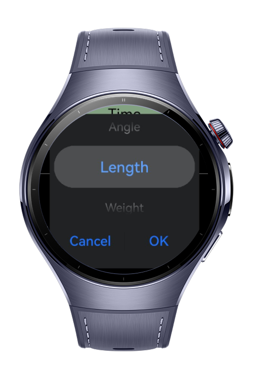
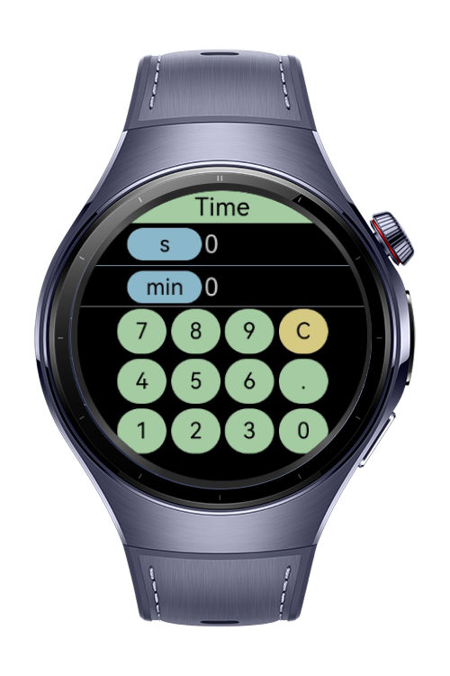
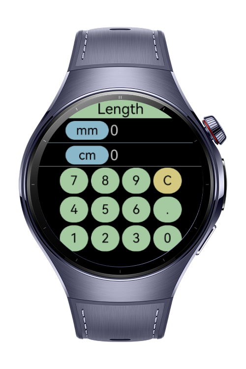
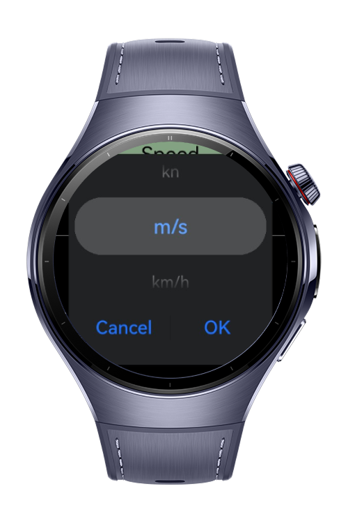

> **Note:** To access all shared projects, get information about environment setup, and view other guides, please visit [Explore-In-HMOS-Wearable Index](https://github.com/Explore-In-HMOS-Wearable/hmos-index).

# Unit Calculator Application

The Unit Converter app is a lightweight and intuitive tool designed for quick and accurate unit conversions across
various measurement categories. Whether you're handling metric or imperial systems, this app provides offline conversion with precision and ease.

# Preview

<div>
    
    
    
    
</div>

# Use Cases
This application is ideal for converting various units such as length, weight, speed, and pressure. 
The values and units that can be converted within the scope of the application are as follows:
- Length: `mm`, `cm`, `m`, `km`, `in`, `ft`, `yd`, `mi`
- Weight: `mg`, `g`, `kg`, `t`, `oz`, `lb`, `st`
- Temperature: `°C`, `°F`, `K`
- Volume: `ml`, `l`, `cc`, `m³`, `tsp`, `tbsp`, `fl oz`, `cup`, `pt`, `qt`, `gal`
- Area: `cm²`, `m²`, `km²`, `in²`, `ft²`, `yd²`, `ac`, `ha`
- Speed: `m/s`, `km/h`, `mph`, `ft/s`, `kn`
- Time: `s`, `min`, `h`, `d`, `wk`, `mo`, `yr`
- Pressure: `Pa`, `kPa`, `bar`, `mbar`, `atm`, `psi`, `torr`
- Energy: `J`, `kJ`, `cal`, `kcal`, `Wh`, `kWh`, `BTU`
- Power: `W`, `kW`, `hp`, `BTU/h`
- Angle: `°`, `rad`, `gon`

# Tech Stack
- Languages: ArkTS
- Frameworks: HarmonyOS SDK 5.0.0(12)
- Tools: DevEco Studio Vers 5.1.0.823

# Directory Structure
```
entry/src/main/ets/
|---components
|   |---CalcButton.ets             // Calculator button component
|   |---CalcResultComponent.ets    // Result display component
|   |---CalculatorComponent.ets    // Main calculator component
|   |---UnitButton.ets             // Unit conversion button component
|---entryability
|   |---EntryAbility.ets           // Main application entry ability
|---entrybackupability
|   |---EntryBackupAbility.ets     // Backup ability implementation
|---pages
|   |---Index.ets                  // Main entry page
|---utils
|   |---UnitEnums.ets              // Unit type enumerations
|   |---UnitUtils.ets              // Unit conversion utilities
|---resources
|---module.json5                   // Permissions and meta config

```

# Constraints and Restrictions

## Supported Device
- Huawei Watch 5

# License
Unit Calculator Application is distributed under the terms of the MIT License. See the [LICENSE](./LICENSE) for more information